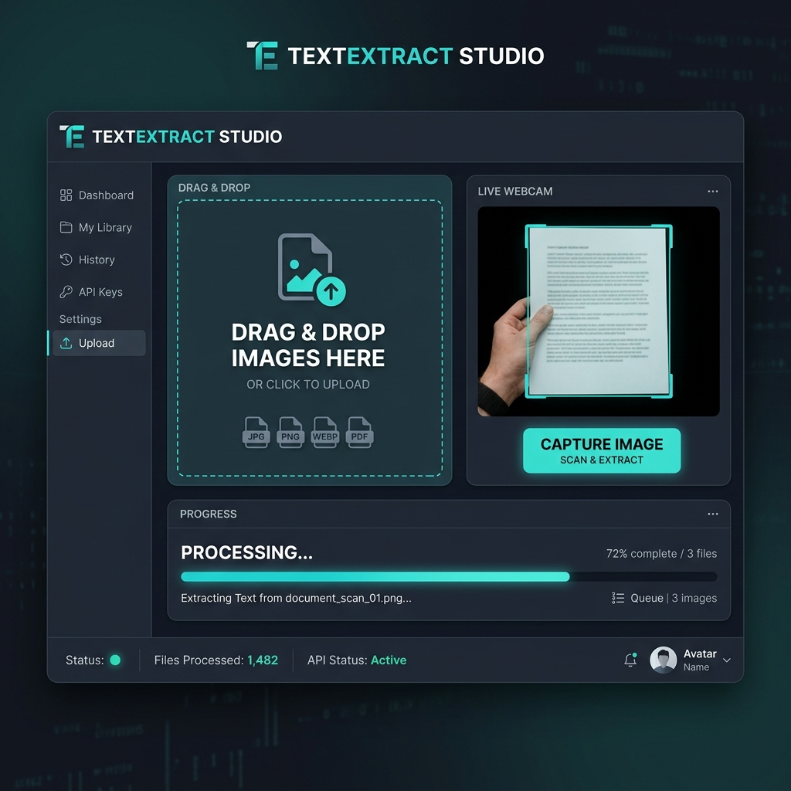

# 👁️ TextExtract Studio

TextExtract Studio is a premium, high-performance vision-processing environment designed to transform visual data into refined, editable digital text. Built with state-of-the-art web technologies, it offers a seamless bridge between physical documents and digital workflows.



## ✨ Premium Features

- **🚀 AI-Powered OCR**: Leverages the Tesseract.js engine for high-precision text extraction directly in your browser.
- **📸 Versatile Input Methods**: 
    - **Intelligent Drag & Drop**: Effortless file uploads with real-time previews.
    - **Integrated Live Webcam**: Capture and process images on the fly with native camera integration.
- **✂️ Professional Image Refinement**: Built-in cropping and scaling tools to isolate specific text regions, maximizing OCR accuracy.
- **📊 Real-time Processing Engine**: Watch the extraction happen with a beautiful, high-fidelity progress tracking system.
- **🔐 Enterprise-Grade Auth**: Secured by **Clerk**, providing robust user management and protected workspaces.
- **🎨 State-of-the-Art UI/UX**:
    - **Modern Aesthetics**: Sleek dark-mode inspired design with teal and slate accents.
    - **Liquid Motion**: Ultra-smooth transitions and micro-interactions powered by **Framer Motion**.
    - **Component Driven**: Built with **Radix UI** primitives for maximum accessibility and reliability.

## 🛠️ The Technology Stack

| Layer | Technology |
| :--- | :--- |
| **Framework** | [React 18](https://reactjs.org/) + [Vite](https://vitejs.dev/) |
| **Language** | [TypeScript](https://www.typescriptlang.org/) |
| **OCR Engine** | [Tesseract.js](https://tesseract.projectnaptha.com/) |
| **Styling** | [Tailwind CSS](https://tailwindcss.com/) |
| **Animations** | [Framer Motion](https://www.framer.com/motion/) |
| **Auth** | [Clerk](https://clerk.com/) |
| **UI Core** | [Radix UI](https://www.radix-ui.com/) + [Lucide Icons](https://lucide.dev/) |

## 🚀 Getting Started

### Prerequisites

- Node.js (v18.0.0+)
- npm / yarn / pnpm

### Installation

1. **Clone the repository**:
   ```bash
   git clone https://github.com/HemantaBhattarai5i/TextExtract.git
   cd TextExtract
   ```

2. **Install dependencies**:
   ```bash
   npm install
   ```

3. **Configure Environment**:
   Create a `.env` file in the root directory:
   ```env
   VITE_CLERK_PUBLISHABLE_KEY=pk_test_...
   VITE_CLERK_SECRET_KEY=sk_test_...
   ```

4. **Launch Developer Studio**:
   ```bash
   npm run dev
   ```

## 📖 How it Works

1. **Authentication**: Sign in to unlock your personal workspace.
2. **Visual Input**: Upload an image or use the 'Live Capture' mode via your webcam.
3. **Refine**: Use the cropping tool to focus the AI on specific text blocks for 100% precision.
4. **Extract**: Hit 'Process' and watch the studio convert your image into selectable text.
5. **Export**: Copy your refined text for use in any other application.

## 🤝 Contributing

Contributions are what make the open-source community such an amazing place to learn, inspire, and create. Any contributions you make are **greatly appreciated**.

## 📄 License

Distributed under the MIT License. See `LICENSE` for more information.

---

**Created & Owned by Hemanta Bhattarai**
